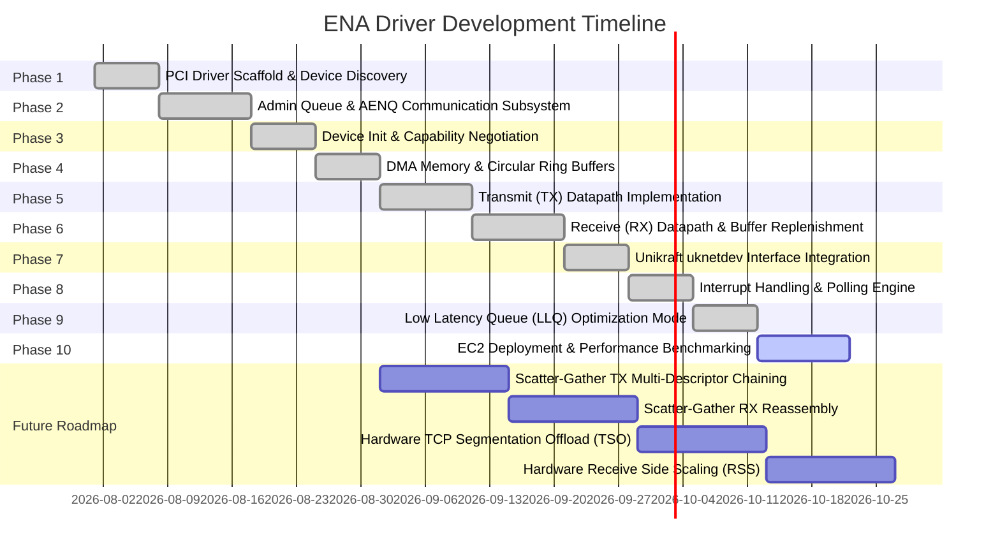

# ENA Unikraft Driver: Roadmap and Milestones

## 1. Project Objective

Develop and validate a native AWS Elastic Network Adapter (ENA) driver in Unikraft OS.
The driver integrates with `ukbus_pci` and `uknetdev` to provide high network performance on AWS EC2.

---

## 2. Milestones (Phases 1 to 10)

### Phase 1: PCI Driver Scaffold and Device Discovery
- **Status**: Completed
- Register ENA PCI Vendor ID (`0x1D0F`) and Device IDs (`0x0EC2`, `0xEC20`, `0x1EC2`) with `ukbus_pci`.
- Map BAR0 MMIO space and verify controller reset and status registers.
- Provide standalone mock MMIO test harness for offline unit testing.

### Phase 2: Admin Queue & AENQ Communication Subsystem
- **Status**: Completed
- Allocate DMA memory for Admin Submission (AQ) and Completion (ACQ) Queues.
- Implement synchronous command execution loop with timeouts and phase bit tracking.
- Implement AENQ listener for asynchronous device health events.

### Phase 3: Device Initialization and Capability Negotiation
- **Status**: Completed
- Read device attributes (`ENA_ADMIN_DEVICE_ATTRIBUTES`).
- Set host info and driver version.
- Negotiate MTU, queue limits, and MAC address.

### Phase 4: DMA Memory Management and Circular Ring Buffers
- **Status**: Completed
- Implement page-aligned circular DMA rings for IO SQ and CQ.
- Create tracking arrays for outstanding `uk_netbuf` packets and request IDs.

### Phase 5: Transmit (TX) Datapath Implementation
- **Status**: Completed
- Serialize `ena_eth_io_tx_desc` into TX SQ.
- Ring TX doorbells.
- Poll TX CQ completions and recycle transmitted `uk_netbuf` structures.
- Support L3 and L4 checksum offload flags.

### Phase 6: Receive (RX) Datapath and Buffer Management
- **Status**: Completed
- Pre-allocate and populate RX SQ with `uk_netbuf` buffers.
- Poll RX CQ phase bits.
- Parse packet metadata (checksum status, packet length, hash) and hand off to `uknetdev`.
- Replenish consumed RX descriptors.

### Phase 7: Unikraft uknetdev Interface Integration
- **Status**: Completed
- Implement `struct uk_netdev_ops` callbacks (`dev_configure`, `rxq_configure`, `txq_configure`, `dev_start`, `dev_stop`, `rxq_recv`, `txq_xmit`).
- Register device instance with `uk_netdev_register`.

### Phase 8: Interrupt Handling and Polling Engine
- **Status**: Completed
- Implement MSI-X vector allocation for RX and AENQ.
- Implement polling worker thread mode for high throughput.

### Phase 9: Low Latency Queue (LLQ) Optimization Mode
- **Status**: Completed
- Detect BAR2 memory region.
- Implement direct MMIO push for TX descriptors and packet headers.

### Phase 10: Validation, EC2 Deployment, and Performance Benchmarking
- **Status**: In Progress
- Create the EC2 deployment guide (`docs/ec2_deployment.md`).
- Create the benchmark measurement template (`scripts/ec2_benchmark.sh`).
- Real measurements on EC2 hardware are pending. Store the results in the Fossil unversioned store (`fossil uv`).

---

## 3. Future Roadmap and Enhancements (Phases 11 to 14)

### Phase 11: Multi-Descriptor Scatter-Gather (SG) Transmit
- **Status**: Planned
- Update `ena_tx_submit` to break multi-fragment `uk_netbuf` chains across consecutive SQ descriptors.
- Set `FIRST` and `LAST` descriptor flags for multi-buffer frames.
- Free all chained buffers upon completion of the last descriptor.

### Phase 12: Scatter-Gather (SG) Receive Reassembly
- **Status**: Planned
- Track chained RX completion descriptors across multi-buffer packets.
- Reassemble multi-descriptor payload chains into contiguous or chained `uk_netbuf` structures.
- Pass assembled packet to Unikraft network stack.

### Phase 13: Hardware TCP Segmentation Offload (TSO)
- **Status**: Planned
- Support large TCP packet segmentation offload.
- Populate ENA header metadata and segmentation size in TX descriptors.
- Offload TCP segmentation from the software stack to the ENA controller.

### Phase 14: Hardware Receive Side Scaling (RSS)
- **Status**: Planned
- Configure RSS hash key and indirection table via Admin Queue feature commands.
- Distribute incoming traffic across multiple RX queues based on packet 4-tuple flow hashes.
