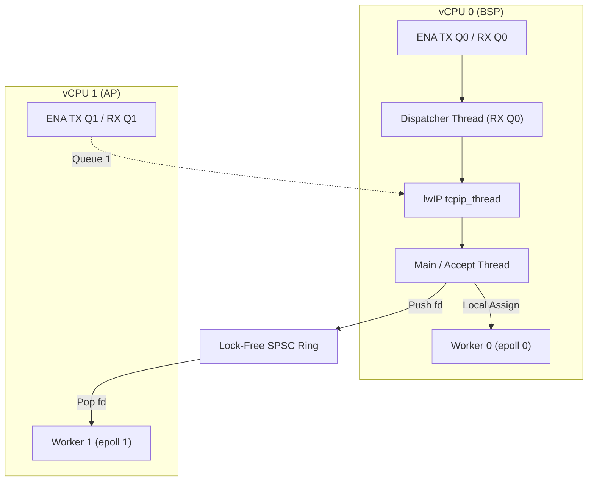

# Multi-Core Unikraft HTTP Reply Benchmark (`httpreply-mc`)

## 1. Overview

This sample provides a multi-core HTTP reply benchmark server for Unikraft on AWS EC2. It uses the native AWS ENA driver (`lib-ena`) and the threaded lwIP network stack.

The single-core sample runs lwIP in `NO_SYS` mode with one thread. This multi-core sample runs with multiple threads:
- It configures multiple ENA queue pairs (one pair per core).
- It runs one dispatcher thread per receive queue.
- It distributes accepted connections to worker threads through lock-free SPSC rings.
- Each worker thread handles requests with its own epoll instance.

## 2. Architecture

The server separates connection acceptance, packet dispatch, and HTTP processing across threads:



## 3. Directory Layout

| Path | Purpose |
| :--- | :--- |
| `main.c` | Multi-worker HTTP echo server with accept-and-distribute loop |
| `spsc.h` | Lock-free single-producer single-consumer ring buffer |
| `Config.uk` | Application Kconfig options |
| `defconfig` | Target configuration for multi-core KVM and multi-queue ENA |
| `Makefile` | Top-level build entry point with automated patch application |
| `Makefile.uk` | Build definitions for Unikraft build system |
| `Kraftfile` | KraftKit specification referencing `lib-ena` from repository root |
| `patches/` | Submodule patches for lwIP and Unikraft core |
| `scripts/apply_patches.sh` | Idempotent patch application script |
| `scripts/build_disk.sh` | Builds raw bootable disk image with GRUB |
| `scripts/deploy_aws.py` | Deploys image to AWS EBS and launches EC2 instance |
| `scripts/run_ec2_benchmark.py` | Automated multi-concurrency benchmark runner |
| `benchmark_results.csv` | Measured benchmark metrics in CSV format |
| `benchmark_results.json` | Measured benchmark metrics in JSON format |

## 4. Build Instructions

### Option 1: Build with Make and Submodules

1. Initialize git submodules:
   ```bash
   git submodule update --init --recursive
   ```
2. Generate the configuration file from defconfig:
   ```bash
   cp defconfig .config
   make olddefconfig
   ```
3. Build the unikernel image:
   ```bash
   make
   ```

Output binaries:
- `build/httpreply-mc_qemu-x86_64`: Multiboot ELF unikernel.
- `build/httpreply-mc_qemu-x86_64.bootinfo`: UKBI bootinfo blob.

### Option 2: Build with KraftKit

```bash
kraft build --target aws-t3-x86_64
```

## 5. Deploy to Amazon EC2

Deploy the unikernel to an AWS EC2 instance. This sample requires an instance type with at least two vCPUs, such as `c6i.large`.

```bash
SUBNET_ID=subnet-xxxxxx \
PRIVATE_IP=172.31.x.y \
GATEWAY_IP=172.31.x.1 \
NETMASK=255.255.240.0 \
INSTANCE_TYPE=c6i.large \
python3 scripts/deploy_aws.py
```

The script builds the unikernel, creates the disk image, registers an AMI, and launches the instance.

## 6. Run Benchmarks on AWS

Test connectivity to the instance:

```bash
curl -i http://<instance-public-or-private-ip>/
```

Run the automated benchmark suite with `wrk`:

```bash
python3 scripts/run_ec2_benchmark.py
```

Or run `wrk` manually with keep-alive connections:

```bash
wrk -t4 -c200 -d10s --latency http://<instance-ip>/
```

## 7. Configuration Reference

Key Kconfig options used in `defconfig`:

| Option | Value | Description |
| :--- | :--- | :--- |
| `CONFIG_UKPLAT_CPU_MAXCOUNT` | `2` | Maximum number of CPU cores configured for KVM |
| `CONFIG_HAVE_SMP` | `y` | Enables Symmetric Multi-Processing support |
| `CONFIG_LWIP_THREADS` | `y` | Enables threaded lwIP core (`tcpip_thread`) |
| `CONFIG_LIBUKNETDEV_MAXNBQUEUES` | `2` | Configures two hardware network queue pairs |
| `CONFIG_LIBUKNETDEV_DISPATCHERTHREADS` | `y` | Runs one dispatcher thread per RX queue |
| `CONFIG_LIBENA` | `y` | Enables native AWS ENA driver |
| `CONFIG_LIBENA_LLQ` | `y` | Enables ENA Low Latency Queue support |
| `CONFIG_LIBENA_MAX_QUEUES` | `8` | Maximum queue pairs supported by ENA driver |
| `CONFIG_LIBENA_VERBOSE_STATS` | `y` | Prints periodic datapath counters to console |

## 8. Benchmark Results (AWS EC2 `c6i.large`)

The following measurements show `httpreply-mc` compared with the single-threaded Unikraft sample and Ubuntu 24.04 Linux on AWS EC2 `c6i.large` instances. All instances ran in the same subnet (`us-east-1a`). The client ran `wrk` with four threads for 10 seconds per concurrency step.

| Concurrency | Target | Requests/sec | Avg Latency (ms) | p99 Latency (ms) | Max Latency (ms) | Socket Errors |
| :--- | :--- | :--- | :--- | :--- | :--- | :--- |
| 1 | Unikraft Single-Threaded | 4,270.75 | 0.24 | -- | 8.29 | 0 |
| 1 | Unikraft Multi-Core | 3,303.61 | 0.49 | 0.37 | 62.62 | 0 |
| 1 | Linux (Ubuntu 24.04) | 15,076.10 | 0.07 | 0.10 | 3.59 | 0 |
| 5 | Unikraft Single-Threaded | 16,894.78 | 0.24 | -- | 0.65 | 0 |
| 5 | Unikraft Multi-Core | 12,461.14 | 2.11 | 56.42 | 121.82 | 0 |
| 5 | Linux (Ubuntu 24.04) | 44,893.00 | 0.09 | 0.14 | 0.54 | 0 |
| 10 | Unikraft Single-Threaded | 37,804.21 | 0.26 | -- | 0.77 | 0 |
| 10 | Unikraft Multi-Core | 23,352.57 | 2.71 | 55.49 | 66.00 | 0 |
| 10 | Linux (Ubuntu 24.04) | 78,330.14 | 0.10 | 0.16 | 0.26 | 0 |
| 25 | Unikraft Single-Threaded | 78,089.40 | 0.30 | -- | 4.42 | 0 |
| 25 | Unikraft Multi-Core | 51,749.84 | 6.44 | 61.85 | 128.73 | 0 |
| 25 | Linux (Ubuntu 24.04) | 166,217.23 | 0.14 | 0.24 | 0.85 | 0 |
| 50 | Unikraft Single-Threaded | 133,790.20 | 0.36 | -- | 1.03 | 0 |
| 50 | Unikraft Multi-Core | 76,308.20 | 8.40 | 62.21 | 83.14 | 0 |
| 50 | Linux (Ubuntu 24.04) | 205,061.04 | 0.23 | 0.45 | 2.03 | 0 |
| 100 | Unikraft Single-Threaded | 153,725.24 | 0.63 | -- | 1.50 | 0 |
| 100 | Unikraft Multi-Core | 101,924.98 | 10.98 | 63.80 | 128.71 | 0 |
| 100 | Linux (Ubuntu 24.04) | 208,736.74 | 0.47 | 0.81 | 5.52 | 0 |
| 200 | Unikraft Single-Threaded | 155,213.30 | 1.27 | -- | 2.20 | 0 |
| 200 | Unikraft Multi-Core | 100,248.45 | 11.24 | 63.59 | 67.28 | 0 |
| 200 | Linux (Ubuntu 24.04) | 201,060.17 | 1.00 | 1.48 | 29.76 | 0 |
| 500 | Unikraft Single-Threaded | -- | -- | -- | -- | -- |
| 500 | Unikraft Multi-Core | 59,873.66 | 13.93 | 70.69 | 136.28 | 0 |
| 500 | Linux (Ubuntu 24.04) | 195,779.04 | 3.13 | 13.09 | 170.80 | 0 |

Measurements show zero socket errors across all concurrency levels. Both worker threads processed 2.15 million requests with balanced distribution. Throughput peaked at 101,924.98 requests per second at concurrency 100.

## 9. Design Decisions

### Accept-and-Distribute Model
The main thread accepts connections on a single listening socket. It distributes connections round-robin across worker threads. This model avoids lock contention on the listener.

### Why Not SO_REUSEPORT
Unikraft lwIP does not implement `SO_REUSEPORT` socket load balancing. A central accept loop with lock-free SPSC distribution provides the cleanest model without kernel modifications.

### Cooperative Scheduler Constraints
The Unikraft scheduler uses cooperative thread execution. Each worker explicitly yields through `uk_sched_yield()` during event loops. This ensures fair scheduling between packet dispatchers, stack threads, and HTTP workers.
