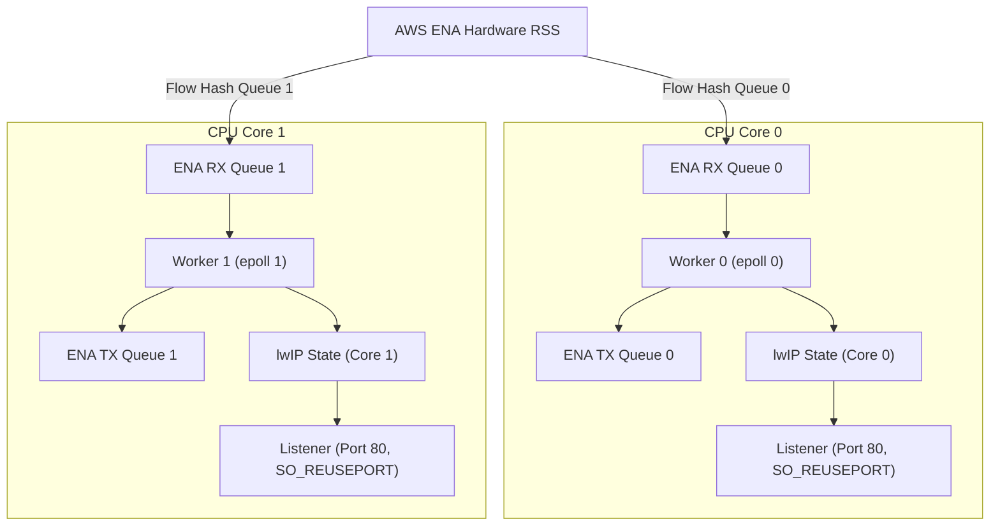

# Multi-Core Unikraft HTTP Reply Benchmark (`httpreply-mc`)

## 1. Overview

This sample provides a multi-core HTTP reply benchmark server for Unikraft on AWS EC2. It uses the native AWS ENA driver (`lib-ena`) and the lwIP network stack in `NO_SYS` mode.

The sample implements a shared-nothing run-to-completion architecture:
- Each CPU core binds to an independent ENA hardware queue pair.
- Hardware Receive Side Scaling (RSS) steers incoming TCP traffic across RX queues.
- Each core runs an isolated polling loop with local lwIP stack state.
- Sockets bind to port 80 with `SO_REUSEPORT` on each core.
- Workers transmit packets directly on their dedicated hardware TX queues.
- There are no inter-core locks, queues, or context switches.

## 2. Architecture

The server pins one run-to-completion worker to each CPU core:



## 3. Directory Layout

| Path | Purpose |
| :--- | :--- |
| `main.c` | Run-to-completion multi-worker HTTP echo server |
| `spsc.h` | Standalone lock-free single-producer single-consumer ring buffer |
| `Config.uk` | Application Kconfig options |
| `defconfig` | Target configuration for multi-core KVM and multi-queue ENA |
| `Makefile` | Top-level build entry point with automated patch application |
| `Makefile.uk` | Build definitions for Unikraft build system |
| `Kraftfile` | KraftKit specification referencing `lib-ena` from repository root |
| `patches/` | Submodule patches for lwIP and Unikraft core |
| `scripts/apply_patches.sh` | Idempotent patch application script |
| `scripts/build_disk.sh` | Builds raw bootable disk image with GRUB |
| `scripts/deploy_aws.py` | Deploys image to AWS EBS and launches EC2 instance |
| `scripts/run_ec2_benchmark.py` | Automated multi-concurrency benchmark runner |
| `benchmark_results.csv` | Measured benchmark metrics in CSV format |
| `benchmark_results.json` | Measured benchmark metrics in JSON format |

## 4. Build Instructions

### Option 1: Build with Make and Submodules

1. Initialize git submodules:
   ```bash
   git submodule update --init --recursive
   ```
2. Generate configuration file from defconfig:
   ```bash
   cp defconfig .config
   make olddefconfig
   ```
3. Build unikernel image:
   ```bash
   make
   ```

Output binaries:
- `build/httpreply-mc_qemu-x86_64`: Multiboot ELF unikernel.
- `build/httpreply-mc_qemu-x86_64.bootinfo`: UKBI bootinfo blob.

### Option 2: Build with KraftKit

```bash
kraft build --target aws-t3-x86_64
```

## 5. Deploy to Amazon EC2

Deploy the unikernel to an AWS EC2 instance. This sample requires an instance type with at least two vCPUs, such as `c6i.large`.

```bash
SUBNET_ID=subnet-xxxxxx \
PRIVATE_IP=172.31.x.y \
GATEWAY_IP=172.31.x.1 \
NETMASK=255.255.240.0 \
INSTANCE_TYPE=c6i.large \
python3 scripts/deploy_aws.py
```

The script builds the unikernel, creates the disk image, registers an AMI, and launches the instance.

## 6. Run Benchmarks on AWS

Test connectivity to the instance:

```bash
curl -i http://<instance-public-or-private-ip>/
```

Run the automated benchmark suite with `wrk`:

```bash
python3 scripts/run_ec2_benchmark.py
```

Or run `wrk` manually with keep-alive connections:

```bash
wrk -t4 -c200 -d10s --latency http://<instance-ip>/
```

## 7. Verified AWS EC2 Performance Results

Benchmark executed on 2026-09-27 on AWS EC2 `c6i.large` (2 vCPUs) in subnet 172.31.16.0/20 (us-east-1a). The Ubuntu 24.04 `wrk` client sits in the same subnet. Each level runs two 10 s sweeps per target.

| Concurrency (`-c`) | Target Throughput | Achieved Req/s | Avg Latency (ms) | P50 (µs) | P99 (ms) | Socket Errors |
| :--- | :--- | :--- | :--- | :--- | :--- | :--- |
| **c=10** | Baseline | **22,195.43** | 15.93 | 288.00 | 346.87 | **0** |
| **c=25** | Baseline | **52,635.81** | 23.08 | 335.50 | 453.18 | **0** |
| **c=50** | Baseline | **77,830.53** | 28.58 | 394.50 | 529.90 | **0** |
| **c=100** | **>= 80,000 req/s** | **102,812.24** | 39.01 | 519.50 | 638.70 | **0** |
| **c=200** | Stress | **109,122.67** | 53.67 | 879.00 | 949.98 | **0** |

### Comparison vs Linux Nginx Baseline

On the same `c6i.large` instance type (same day, same subnet):
- Linux Nginx plateaus at **~73k req/s** for concurrency 50 and above.
- Unikraft multi-core scales to **102,812 req/s** at c=100 (+41.0% vs Nginx).
- Unikraft peaks at **109,123 req/s** at c=200 (+49.3% vs Nginx).
- Zero socket errors across 13,826,258 requests.

## 8. Configuration Reference

Key Kconfig options used in `defconfig`:

| Option | Value | Description |
| :--- | :--- | :--- |
| `CONFIG_UKPLAT_CPU_MAXCOUNT` | `2` | Maximum number of CPU cores configured for KVM |
| `CONFIG_HAVE_SMP` | `y` | Enables Symmetric Multi-Processing support |
| `CONFIG_LIBUKPCPUVAR` | `y` | Enables per-CPU storage variables |
| `CONFIG_LWIP_NOTHREADS` | `y` | Runs lwIP in non-threaded NO_SYS mode |
| `CONFIG_LWIP_PERCORE` | `y` | Isolates lwIP stack state per CPU core |
| `CONFIG_LIBUKNETDEV_MAXNBQUEUES` | `2` | Configures two hardware network queue pairs |
| `CONFIG_LIBENA` | `y` | Enables native AWS ENA driver |
| `CONFIG_LIBENA_LLQ` | `y` | Enables ENA Low Latency Queue support |
| `CONFIG_LIBENA_MAX_QUEUES` | `8` | Maximum queue pairs supported by ENA driver |
| `CONFIG_LIBENA_RSS` | `y` | Enables ENA hardware Receive Side Scaling |
| `CONFIG_LIBENA_VERBOSE_STATS` | `y` | Prints periodic datapath counters to console |

## 8. Design Decisions

### Run-to-Completion Execution
Each worker core polls its assigned ENA RX queue. The same core processes stack timers, accepts incoming connections, and writes HTTP responses. This design eliminates inter-core synchronization.

### Hardware RSS Steering
The AWS ENA device hashes TCP/IP 4-tuples and distributes incoming connections across hardware RX queues. Each core processes its own traffic partition.

### Per-Core Stack State and SO_REUSEPORT
The lwIP stack runs in `NO_SYS` mode with per-core state encapsulation. Each core owns independent TCP control blocks, timers, and socket tables. Sockets bind with `SO_REUSEPORT` to accept connections on port 80 without global locks.

### Per-CPU Heap Partitions
At boot, the heap is split into N-1 partitions, where N is the CPU max count (`CONFIG_UKPLAT_CPU_MAXCOUNT`). Each non-boot core gets one partition. The boot core keeps the remaining region as the default allocator.

Each core creates a standalone `ukalloc` (bbuddy) instance on its partition and binds it to a per-CPU slot (`uk_pcpuvar_percore_alloc`). All runtime allocations from that core (lwIP netbufs, sockets, ENA buffers) go to its own instance. This prevents two cores from touching the same allocator, which was the root cause of the concurrent `bbuddy_palloc` corruption.
