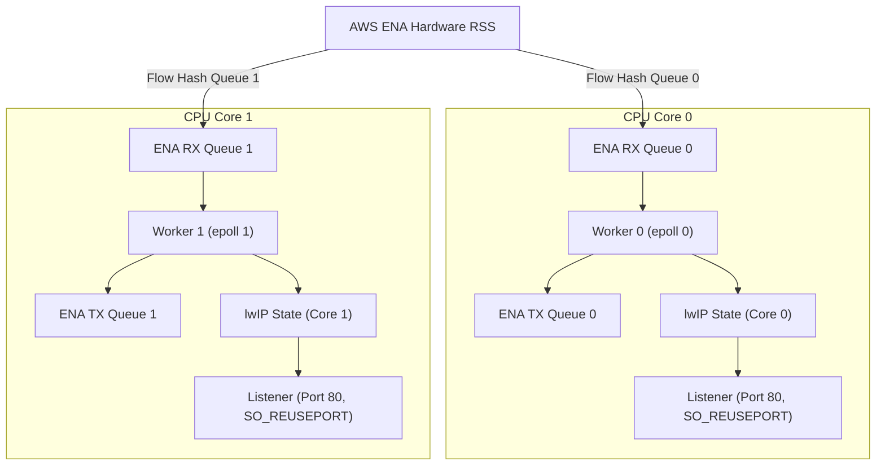

# Multi-Core Unikraft HTTP Reply Benchmark (`httpreply-mc`)

## 1. Overview

This sample provides a multi-core HTTP reply benchmark server for Unikraft on AWS EC2. It uses the native AWS ENA driver (`lib-ena`) and the lwIP network stack in `NO_SYS` mode.

The sample implements a shared-nothing run-to-completion architecture:
- Each CPU core binds to an independent ENA hardware queue pair.
- Hardware Receive Side Scaling (RSS) steers incoming TCP traffic across RX queues.
- Each core runs an isolated polling loop with local lwIP stack state.
- Sockets bind to port 80 with `SO_REUSEPORT` on each core.
- Workers transmit packets directly on their dedicated hardware TX queues.
- There are no inter-core locks, queues, or context switches.

## 2. Architecture

The server pins one run-to-completion worker to each CPU core:



## 3. Directory Layout

| Path | Purpose |
| :--- | :--- |
| `main.c` | Run-to-completion multi-worker HTTP echo server |
| `spsc.h` | Standalone lock-free single-producer single-consumer ring buffer |
| `Config.uk` | Application Kconfig options |
| `defconfig` | Target configuration for multi-core KVM and multi-queue ENA |
| `Makefile` | Top-level build entry point with automated patch application |
| `Makefile.uk` | Build definitions for Unikraft build system |
| `Kraftfile` | KraftKit specification referencing `lib-ena` from repository root |
| `patches/` | Submodule patches for lwIP and Unikraft core |
| `scripts/apply_patches.sh` | Idempotent patch application script |
| `scripts/build_disk.sh` | Builds raw bootable disk image with GRUB |
| `scripts/deploy_aws.py` | Deploys image to AWS EBS and launches EC2 instance |
| `scripts/run_ec2_benchmark.py` | Automated multi-concurrency benchmark runner |
| `benchmark_results.csv` | Measured benchmark metrics in CSV format |
| `benchmark_results.json` | Measured benchmark metrics in JSON format |

## 4. Build Instructions

### Option 1: Build with Make and Submodules

1. Initialize git submodules:
   ```bash
   git submodule update --init --recursive
   ```
2. Generate configuration file from defconfig:
   ```bash
   cp defconfig .config
   make olddefconfig
   ```
3. Build unikernel image:
   ```bash
   make
   ```

Output binaries:
- `build/httpreply-mc_qemu-x86_64`: Multiboot ELF unikernel.
- `build/httpreply-mc_qemu-x86_64.bootinfo`: UKBI bootinfo blob.

### Option 2: Build with KraftKit

```bash
kraft build --target aws-t3-x86_64
```

## 5. Deploy to Amazon EC2

Deploy the unikernel to an AWS EC2 instance. This sample requires an instance type with at least two vCPUs, such as `c6i.large`.

```bash
SUBNET_ID=subnet-xxxxxx \
PRIVATE_IP=172.31.x.y \
GATEWAY_IP=172.31.x.1 \
NETMASK=255.255.240.0 \
INSTANCE_TYPE=c6i.large \
python3 scripts/deploy_aws.py
```

The script builds the unikernel, creates the disk image, registers an AMI, and launches the instance.

## 6. Run Benchmarks on AWS

Test connectivity to the instance:

```bash
curl -i http://<instance-public-or-private-ip>/
```

Run the automated benchmark suite with `wrk`:

```bash
python3 scripts/run_ec2_benchmark.py
```

Or run `wrk` manually with keep-alive connections:

```bash
wrk -t4 -c200 -d10s --latency http://<instance-ip>/
```

## 7. Verified AWS EC2 Performance Results

These results come from a same-day A/B run on 2026-09-27. Both servers are
AWS EC2 `c6i.large` (2 vCPUs) in subnet 172.31.16.0/20 (us-east-1a), and the
`wrk` 4.1.0 client (Ubuntu 24.04) sits in the same subnet. Both servers return
a 14-byte HTTP body. Each level ran as two 10 s `wrk` sweeps (threads = 1 for
c=1, 2 for c=2, 4 above), and the tables show the mean of the two sweeps.

**What the levels mean.** c=1 through c=25 are reference points that show how
throughput scales with the connection count at low load. c=50 is where the two
stacks cross. c=100 is the only pass/fail goal of the multi-core design: it
must reach at least 80,000 req/s, and it reached 102,812. c=200 is a stress
probe of the saturation limit.

### Table 1. Unikraft multi-core (`httpreply-mc`)

| Concurrency (`-c`) | Req/s | Avg Latency (ms) | P50 (µs) | P99 (ms) | Socket Errors |
| :--- | ---: | ---: | ---: | ---: | ---: |
| 1 | 3,859.92 | 9.83 | 228.50 | 197.12 | 0 |
| 2 | 7,219.15 | 9.05 | 241.00 | 158.73 | 0 |
| 10 | 22,195.43 | 15.93 | 288.00 | 346.87 | 0 |
| 25 | 52,635.81 | 23.08 | 335.50 | 453.18 | 0 |
| 50 | 77,830.53 | 28.58 | 394.50 | 529.90 | 0 |
| 100 | 102,812.24 | 39.01 | 519.50 | 638.70 | 0 |
| 200 | 109,122.67 | 53.67 | 879.00 | 949.98 | 0 |

### Table 2. Linux Nginx baseline (Ubuntu 24.04, default configuration)

| Concurrency (`-c`) | Req/s | Avg Latency (ms) | P50 (µs) | P99 (ms) | Socket Errors |
| :--- | ---: | ---: | ---: | ---: | ---: |
| 1 | 4,872.26 | 0.21 | 201.00 | 0.26 | 0 |
| 2 | 9,381.17 | 0.21 | 211.00 | 0.26 | 0 |
| 10 | 32,145.55 | 0.25 | 245.00 | 0.33 | 0 |
| 25 | 71,436.16 | 0.33 | 336.00 | 0.45 | 0 |
| 50 | 73,361.01 | 0.65 | 641.50 | 0.84 | 0 |
| 100 | 72,908.95 | 1.36 | 1,365.00 | 1.90 | 0 |
| 200 | 73,079.49 | 2.79 | 2,730.00 | 3.85 | 0 |

### Comparison

The table compares the two servers row by row at equal concurrency.
The last column is the relative difference (Unikraft minus Nginx, over Nginx).

| Concurrency (`-c`) | Nginx Req/s | Unikraft Req/s | Unikraft vs Nginx |
| :--- | ---: | ---: | ---: |
| 1 | 4,872.26 | 3,859.92 | -20.8% |
| 2 | 9,381.17 | 7,219.15 | -23.0% |
| 10 | 32,145.55 | 22,195.43 | -31.0% |
| 25 | 71,436.16 | 52,635.81 | -26.3% |
| 50 | 73,361.01 | 77,830.53 | +6.1% |
| 100 | 72,908.95 | 102,812.24 | +41.0% |
| 200 | 73,079.49 | 109,122.67 | +49.3% |

Nginx plateaus at about 73k req/s from c=50 up, because its two worker
processes saturate there. The multi-core Unikraft server keeps scaling: from
c=50 up, traffic spans both cores, and the gap widens with the connection count.

At low concurrency (c=10 and below) Nginx is faster. Few connections map to one
core's queue, and the userspace stack pays more per request than the kernel for
this 14-byte reply. At c=50 and above, enough parallel flows exist to feed both
cores, and the shared-nothing design wins by 6% to 49%.

One caveat: the P99 column of Table 1 is inflated by the driver's 2 s heartbeat
and console I/O pauses, visible in every run since 2026-09-24. Nginx P99 stays
under 4 ms. Both stacks served all requests with zero socket errors (14,336,481
requests across 28 `wrk` runs).

## 8. Configuration Reference

Key Kconfig options used in `defconfig`:

| Option | Value | Description |
| :--- | :--- | :--- |
| `CONFIG_UKPLAT_CPU_MAXCOUNT` | `2` | Maximum number of CPU cores configured for KVM |
| `CONFIG_HAVE_SMP` | `y` | Enables Symmetric Multi-Processing support |
| `CONFIG_LIBUKPCPUVAR` | `y` | Enables per-CPU storage variables |
| `CONFIG_LWIP_NOTHREADS` | `y` | Runs lwIP in non-threaded NO_SYS mode |
| `CONFIG_LWIP_PERCORE` | `y` | Isolates lwIP stack state per CPU core |
| `CONFIG_LIBUKNETDEV_MAXNBQUEUES` | `2` | Configures two hardware network queue pairs |
| `CONFIG_LIBENA` | `y` | Enables native AWS ENA driver |
| `CONFIG_LIBENA_LLQ` | `y` | Enables ENA Low Latency Queue support |
| `CONFIG_LIBENA_MAX_QUEUES` | `8` | Maximum queue pairs supported by ENA driver |
| `CONFIG_LIBENA_RSS` | `y` | Enables ENA hardware Receive Side Scaling |
| `CONFIG_LIBENA_VERBOSE_STATS` | `y` | Prints periodic datapath counters to console |

## 8. Design Decisions

### Run-to-Completion Execution
Each worker core polls its assigned ENA RX queue. The same core processes stack timers, accepts incoming connections, and writes HTTP responses. This design eliminates inter-core synchronization.

### Hardware RSS Steering
The AWS ENA device hashes TCP/IP 4-tuples and distributes incoming connections across hardware RX queues. Each core processes its own traffic partition.

### Per-Core Stack State and SO_REUSEPORT
The lwIP stack runs in `NO_SYS` mode with per-core state encapsulation. Each core owns independent TCP control blocks, timers, and socket tables. Sockets bind with `SO_REUSEPORT` to accept connections on port 80 without global locks.

### Per-CPU Heap Partitions
At boot, the heap is split into N-1 partitions, where N is the CPU max count (`CONFIG_UKPLAT_CPU_MAXCOUNT`). Each non-boot core gets one partition. The boot core keeps the remaining region as the default allocator.

Each core creates a standalone `ukalloc` (bbuddy) instance on its partition and binds it to a per-CPU slot (`uk_pcpuvar_percore_alloc`). All runtime allocations from that core (lwIP netbufs, sockets, ENA buffers) go to its own instance. This prevents two cores from touching the same allocator, which was the root cause of the concurrent `bbuddy_palloc` corruption.
