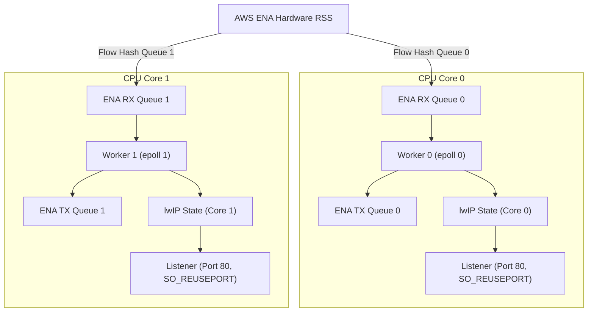

# Multi-Core Unikraft HTTP Reply Benchmark (`httpreply-mc`)

## 1. Overview

This sample provides a multi-core HTTP reply benchmark server for Unikraft on AWS EC2. It uses the native AWS ENA driver (`lib-ena`) and the lwIP network stack in `NO_SYS` mode.

The sample implements a shared-nothing run-to-completion architecture:
- Each CPU core binds to an independent ENA hardware queue pair.
- Hardware Receive Side Scaling (RSS) steers incoming TCP traffic across RX queues.
- Each core runs an isolated polling loop with local lwIP stack state.
- Sockets bind to port 80 with `SO_REUSEPORT` on each core.
- Workers transmit packets directly on their dedicated hardware TX queues.
- There are no inter-core locks, queues, or context switches.

## 2. Architecture

The server pins one run-to-completion worker to each CPU core:



## 3. Directory Layout

| Path | Purpose |
| :--- | :--- |
| `main.c` | Run-to-completion multi-worker HTTP echo server |
| `spsc.h` | Standalone lock-free single-producer single-consumer ring buffer |
| `Config.uk` | Application Kconfig options |
| `defconfig` | Target configuration for multi-core KVM and multi-queue ENA |
| `Makefile` | Top-level build entry point with automated patch application |
| `Makefile.uk` | Build definitions for Unikraft build system |
| `Kraftfile` | KraftKit specification referencing `lib-ena` from repository root |
| `patches/` | Submodule patches for lwIP and Unikraft core, with [problem and approach notes](patches/README.md) |
| `scripts/apply_patches.sh` | Idempotent patch application script |
| `scripts/build_disk.sh` | Builds raw bootable disk image with GRUB |
| `scripts/deploy_aws.py` | Deploys image to AWS EBS and launches EC2 instance |
| `scripts/run_ec2_benchmark.py` | Automated multi-concurrency benchmark runner |
| `scripts/run_ec2_verification.py` | Full EC2 benchmark with console capture. Add `--smoke` for a bring-up check with no `wrk` sweep |
| `benchmark_results.csv` | Measured benchmark metrics in CSV format |
| `benchmark_results.json` | Measured benchmark metrics in JSON format |

## 4. Build Instructions

### Option 1: Build with Make and Submodules

1. Initialize git submodules:
   ```bash
   git submodule update --init --recursive
   ```
2. Generate configuration file from defconfig:
   ```bash
   cp defconfig .config
   make olddefconfig
   ```
3. Build unikernel image:
   ```bash
   make
   ```

Output binaries:
- `build/httpreply-mc_qemu-x86_64`: Multiboot ELF unikernel.
- `build/httpreply-mc_qemu-x86_64.bootinfo`: UKBI bootinfo blob.

### Option 2: Build with KraftKit

```bash
kraft build --target aws-t3-x86_64
```

## 5. Deploy to Amazon EC2

Deploy the unikernel to an AWS EC2 instance. This sample requires an instance type with at least two vCPUs, such as `c6i.large`.

```bash
SUBNET_ID=subnet-xxxxxx \
PRIVATE_IP=172.31.x.y \
GATEWAY_IP=172.31.x.1 \
NETMASK=255.255.240.0 \
INSTANCE_TYPE=c6i.large \
python3 scripts/deploy_aws.py
```

The script builds the unikernel, creates the disk image, registers an AMI, and launches the instance.

## 6. Run Benchmarks on AWS

Test connectivity to the instance:

```bash
curl -i http://<instance-public-or-private-ip>/
```

### Settings for your own AWS account

The EC2 scripts in `scripts/` read their settings from the environment. The
defaults are the values this project's test VPC uses, so a normal run needs no
change. To run against your own account, set these before you start:

| Variable | Meaning |
| :-- | :-- |
| `AWS_REGION` | Region to work in. Default `us-east-1`. |
| `INSTANCE_TYPE` | Target instance type. Default `c6i.large`. |
| `SMOKE_CLIENT_TYPE` | Client type for `--smoke`. Default `t3.micro`. |
| `SUBNET_ID` | Subnet for both instances. Must be the same for both. |
| `SG_ID` | Security group. It must allow inbound TCP 80. |
| `UBUNTU_AMI` | AMI for the client or baseline instance. |
| `TARGET_PRIVATE_IP`, `CLIENT_PRIVATE_IP` | Fixed private IPs the scripts use. |
| `GATEWAY_IP`, `NETMASK` | Written into the guest network config. |

Each script prints the settings it will use before it creates anything. Look for
the `[CONFIG]` line. Credentials come from your AWS CLI configuration, never
from these files. See `scripts/aws_env.py` for the full list and the defaults.

### Smoke check after a driver change

Build the image first, then run the short path. It boots the target on
`c6i.large`, fetches three pages from a small `t3.micro` check client, saves
the console output, and tears everything down. No `wrk` sweep and no CSV.

```bash
python3 scripts/run_ec2_verification.py --smoke
```

The run is good when the client log shows `UK_HEALTH private=200`, three lines
with `code=200`, and `SMOKE_DONE`. The console file shows probe, MSI-X arm,
queue creation, and RSS setup. A clean bring-up has no reset line and no admin
command timeout.

Run the automated benchmark suite with `wrk`:

```bash
python3 scripts/run_ec2_benchmark.py
```

Or run `wrk` manually with keep-alive connections:

```bash
wrk -t4 -c200 -d10s --latency http://<instance-ip>/
```

## 7. Verified AWS EC2 Performance Results

These results come from a same-day A/B run on 2026-10-05, on trunk
revision `cf895d8cec`. This trunk includes the TX reclaim at completion
[Ticket 292e049bf4] and the compiler optimization changes
[Ticket 483416560f]. Both servers are AWS EC2 `c6i.large` (2 vCPUs) in
subnet 172.31.16.0/20 (us-east-1a), and the `wrk` client (Ubuntu 24.04)
sits in the same subnet. Both servers return a 14-byte HTTP body. Each
level ran one 30 s `wrk` sweep with 2 threads.

**What the levels mean.** c=10 and c=25 show throughput at low load.
c=100 is the pass/fail goal of the multi-core design: it must reach at
least 80,000 req/s, and it reached 218,506. c=200 is a stress probe of
the saturation limit.

### Table 1. Unikraft multi-core (`httpreply-mc`)

| Concurrency (`-c`) | Req/s | Avg Latency (ms) | P50 (µs) | P99 (ms) | Socket Errors |
| :--- | ---: | ---: | ---: | ---: | ---: |
| 10 | 51,406.18 | 0.19 | 192.00 | 0.26 | 0 |
| 25 | 103,629.18 | 0.22 | 225.00 | 0.30 | 0 |
| 50 | 154,850.15 | 0.30 | 295.00 | 0.42 | 0 |
| 100 | 218,506.21 | 0.43 | 399.00 | 1.70 | 0 |
| 200 | 223,780.04 | 0.76 | 717.00 | 2.28 | 0 |

### Table 2. Linux Nginx baseline (Ubuntu 24.04, default configuration)

| Concurrency (`-c`) | Req/s | Avg Latency (ms) | P50 (µs) | P99 (ms) | Socket Errors |
| :--- | ---: | ---: | ---: | ---: | ---: |
| 10 | 29,926.21 | 0.34 | 337.00 | 0.43 | 0 |
| 25 | 62,676.13 | 0.38 | 386.00 | 0.49 | 0 |
| 50 | 74,290.73 | 0.67 | 671.00 | 0.88 | 0 |
| 100 | 74,409.55 | 1.34 | 1,330.00 | 1.72 | 0 |
| 200 | 74,014.64 | 2.70 | 2,680.00 | 3.66 | 0 |

### Comparison

The table compares the two servers row by row at equal concurrency.
The last column is the relative difference (Unikraft minus Nginx, over Nginx).

| Concurrency (`-c`) | Nginx Req/s | Unikraft Req/s | Unikraft vs Nginx |
| :--- | ---: | ---: | ---: |
| 10 | 29,926.21 | 51,406.18 | +71.8% |
| 25 | 62,676.13 | 103,629.18 | +65.3% |
| 50 | 74,290.73 | 154,850.15 | +108.4% |
| 100 | 74,409.55 | 218,506.21 | +193.7% |
| 200 | 74,014.64 | 223,780.04 | +202.3% |

Nginx plateaus at about 74k req/s from c=50 up, because its two worker
processes saturate there. The multi-core Unikraft server keeps scaling, and
it now leads Nginx at every measured level, from +72% at c=10 to +202% at
c=200.

These numbers double the throughput of the 2026-09-27 run at the same
levels. Two changes on trunk account for the gain: the driver reclaims TX
bounce slots at completion instead of walking all 256 map entries per send
[Ticket 292e049bf4], and the build now compiles the driver at `-O3` with
LTO [Ticket 483416560f].

The P99 tail also dropped. Earlier runs showed P99 near one second, caused
by the driver heartbeat and console I/O pauses. In this run P99 stays under
2.3 ms, and the average latency stays under 0.8 ms at c=200. Both stacks
served all requests with zero socket errors (32,081,621 requests across
10 `wrk` runs).

### 4-vCPU run (c6i.xlarge, 2026-10-06)

This run tests the 4-core build on trunk revision `42cf122bb3`. That
trunk includes the per-core heap fix [Ticket f47bdd0ed1]. Worker `i` now
runs on CPU `i`, so each queue pair keeps one owner. Both servers are AWS
EC2 `c6i.xlarge` (4 vCPUs) in the same subnet as the client.

Each level runs two phases. First, closed-loop `wrk` 4.1.0 for 30 s gives
throughput, P50, and P99 with the same method as the tables above.
Second, `wrk2` runs for 30 s at a fixed rate of 90 percent of the
measured throughput. `wrk2` reports the coordinated-omission-corrected
P99.9. A fixed rate must stay below capacity, or the rate scheduler
skews the histogram. CPU load comes from CloudWatch `CPUUtilization`
(1-minute datapoints) over each phase window.

### Table 3. Unikraft multi-core, 4 vCPUs (`httpreply-mc`)

| Concurrency (`-c`) | Req/s | Avg Latency (ms) | P50 (µs) | P99 (ms) | P99.9 (ms) | CPU avg/max (%) | Socket Errors |
| :--- | ---: | ---: | ---: | ---: | ---: | ---: | ---: |
| 25 | 53,761.97 | 0.45 | 439.00 | 0.62 | 108.80 | 66.4 / 85.0 | 0 |
| 50 | 98,643.64 | 0.49 | 478.00 | 0.69 | 16.45 | 87.0 / 89.0 | 0 |
| 100 | 177,021.22 | 0.56 | 543.00 | 0.86 | 6.23 | 88.6 / 89.0 | 0 |
| 200 | 270,862.21 | 0.73 | 685.00 | 1.29 | 153.85 | 85.8 / 88.2 | 0 |
| 300 | 304,708.55 | 0.97 | 880.00 | 2.07 | 246.14 | 86.2 / 91.7 | 0 |
| 500 | 306,561.16 | 1.62 | 1,510.00 | 3.03 | 1,210.00 | 91.7 / 91.7 | 0 |

### Table 4. Linux Nginx baseline, 4 vCPUs (Ubuntu 24.04, default configuration)

| Concurrency (`-c`) | Req/s | Avg Latency (ms) | P50 (µs) | P99 (ms) | P99.9 (ms) | CPU avg/max (%) | Socket Errors |
| :--- | ---: | ---: | ---: | ---: | ---: | ---: | ---: |
| 25 | 76,264.07 | 0.32 | 306.00 | 0.40 | 2.29 | 44.1 / 59.9 | 0 |
| 50 | 129,594.32 | 0.37 | 358.00 | 0.50 | 42.72 | 69.1 / 78.3 | 0 |
| 100 | 138,304.01 | 0.72 | 715.00 | 0.94 | 25.76 | 79.4 / 80.5 | 0 |
| 200 | 138,415.46 | 1.44 | 1,430.00 | 1.92 | 27.26 | 82.7 / 86.0 | 0 |
| 300 | 138,261.81 | 2.16 | 2,150.00 | 2.77 | 227.07 | 79.6 / 81.5 | 0 |
| 500 | 136,975.96 | 3.67 | 3,620.00 | 4.85 | 8.74 | 77.7 / 77.7 | 0 |

### Comparison at 4 vCPUs

| Concurrency (`-c`) | Nginx Req/s | Unikraft Req/s | Unikraft vs Nginx |
| :--- | ---: | ---: | ---: |
| 25 | 76,264.07 | 53,761.97 | -29.5% |
| 50 | 129,594.32 | 98,643.64 | -23.9% |
| 100 | 138,304.01 | 177,021.22 | +28.0% |
| 200 | 138,415.46 | 270,862.21 | +95.7% |
| 300 | 138,261.81 | 304,708.55 | +120.4% |
| 500 | 136,975.96 | 306,561.16 | +123.8% |

Nginx with four worker processes plateaus at about 138k req/s from
c=100 up. The Unikraft server keeps scaling to 306k req/s at c=500, and
it leads Nginx from c=100 up. At c=25 and c=50 this run shows Nginx
ahead. The 2-vCPU run above shows Unikraft ahead at those levels, so the
low-concurrency order is not stable across runs.

The 4-core build reaches 306k req/s, 37 percent above the 2-core peak of
223k. A 2026-10-05 run of the same build reached 334k req/s at c=300,
so run-to-run spread is about 10 percent. The P99.9 column also varies
between runs (the same build showed 3.5 ms at c=500 on 2026-10-05 and
1,210 ms here). Treat P99.9 as a one-shot sample, not a stable limit.
P99 stays under 3.1 ms at every level. Both stacks served all requests
with zero socket errors (59,162,607 requests across 12 runs).

Raw output, CSV, and JSON are in `fossil uv` under
`reports/httpreply-mc_2026-10-06/`. The 2026-10-05 4-vCPU run is under
`reports/httpreply-mc_2026-10-05/` with the `4cpu-fixed-` prefix.

### Worker Count and Physical Cores

Set the worker count at or below the number of physical cores on the
target instance. Many EC2 types report two vCPUs per physical core.
`aws ec2 describe-instance-types --instance-types TYPE` prints
`DefaultCores` and `DefaultThreadsPerCore`. c6i.large is 1 core with
2 threads, c6i.xlarge is 2 cores with 2 threads, and c6i.2xlarge is 4
cores with 2 threads.

The table below is the same trunk, the same client, and c=25. The
c6i.2xlarge column is three repeats each. The c6i.xlarge column is
one run each, from the earlier A/B.

| Instance | vCPUs | Physical cores | 2 workers req/s | 4 workers req/s |
| :--- | ---: | ---: | ---: | ---: |
| c6i.xlarge | 4 | 2 | 74,366 | 53,762 |
| c6i.2xlarge | 8 | 4 | 61,543 | 102,842 |

On c6i.xlarge four workers share two physical cores and lose 28
percent. On c6i.2xlarge each worker gets a physical core, and the same
build gains 67 percent over its 2-worker form.

The worker loop rate shows the cause. An idle core polls about 218
times per second. A core that holds connections busy-polls. On
c6i.xlarge that rate is 230k to 270k per second with four workers, and
550k to 620k with two. On c6i.2xlarge four workers reach 424k to
506k. The work per loop iteration does not change. The physical core
is shared.

Do not read this as a queue-count effect. RSS steering, interrupt
moderation, the TX completion guard, and the idle backoff were each
modelled or measured, and none of them explains the change. The
ordered audit is on the Fossil wiki page "ca72834ec7 low-concurrency
investigation plan". [Ticket ca72834ec7]

The low-concurrency order against Nginx in the comparison above
depends on this. Set the worker count to the physical core count
before you compare at c=25 or c=50.

The 2-worker row is not explained. It gives 74,366 req/s on
c6i.xlarge and 61,543 req/s on c6i.2xlarge, on the same trunk. Guest
vCPU placement across physical cores is not controlled from inside the
guest. That effect is tracked separately. [Ticket cc07b8b438]

## 8. Configuration Reference

Key Kconfig options used in `defconfig`:

| Option | Value | Description |
| :--- | :--- | :--- |
| `CONFIG_UKPLAT_CPU_MAXCOUNT` | `2` | Maximum number of CPU cores configured for KVM. Set this at or below the physical core count of the target. See "Worker Count and Physical Cores" in section 7 |
| `CONFIG_HAVE_SMP` | `y` | Enables Symmetric Multi-Processing support |
| `CONFIG_LIBUKPCPUVAR` | `y` | Enables per-CPU storage variables |
| `CONFIG_LWIP_NOTHREADS` | `y` | Runs lwIP in non-threaded NO_SYS mode |
| `CONFIG_LWIP_PERCORE` | `y` | Isolates lwIP stack state per CPU core |
| `CONFIG_LIBUKNETDEV_MAXNBQUEUES` | `2` | Configures two hardware network queue pairs. This is the symbol that sets the active queue count. Keep it equal to `CONFIG_UKPLAT_CPU_MAXCOUNT` |
| `CONFIG_LIBENA` | `y` | Enables native AWS ENA driver |
| `CONFIG_LIBENA_LLQ` | `y` | Enables ENA Low Latency Queue support |
| `CONFIG_LIBENA_MAX_QUEUES` | `8` | Maximum queue pairs supported by ENA driver. This sizes the driver ring arrays, and must stay at or above the active queue count |
| `CONFIG_LIBENA_RSS` | `y` | Enables ENA hardware Receive Side Scaling |
| `CONFIG_LIBENA_VERBOSE_STATS` | `n` | Prints periodic datapath counters to console |

## 9. Design Decisions

### Run-to-Completion Execution
Each worker core polls its assigned ENA RX queue. The same core processes stack timers, accepts incoming connections, and writes HTTP responses. This design eliminates inter-core synchronization.

### Hardware RSS Steering
The AWS ENA device hashes TCP/IP 4-tuples and distributes incoming connections across hardware RX queues. Each core processes its own traffic partition.

### Per-Core Stack State and SO_REUSEPORT
The lwIP stack runs in `NO_SYS` mode with per-core state encapsulation. Each core owns independent TCP control blocks, timers, and socket tables. Sockets bind with `SO_REUSEPORT` to accept connections on port 80 without global locks.

### Per-CPU Heap Partitions
At boot, the heap is split into N-1 partitions, where N is the CPU max count (`CONFIG_UKPLAT_CPU_MAXCOUNT`). Each non-boot core gets one partition. The boot core keeps the remaining region as the default allocator.

Each core creates a standalone `ukalloc` (bbuddy) instance on its partition and binds it to a per-CPU slot (`uk_pcpuvar_percore_alloc`). All runtime allocations from that core (lwIP netbufs, sockets, ENA buffers) go to its own instance. This prevents two cores from touching the same allocator, which was the root cause of the concurrent `bbuddy_palloc` corruption.

### Idle Backoff
The worker loop was an unthrottled spin: at zero traffic it ran the loop
1.3-2.3 M no-work iterations per second per core, each paying a fixed
TSC, ARP, epoll, and queue-peek cost, so both vCPUs read 100% at all
loads. The loop now backs off when it has no work
(`idlebackoff.h`, [Ticket 597c1b9731]):

- An iteration counts as work when an epoll event fires or a packet
  arrives at or leaves the core's hardware queue (cumulative ENA
  counters). After `IB_IDLE_STREAK_LIMIT` (8) consecutive no-work
  iterations, the core sleeps.
- The sleep is a real vCPU halt on the KVM platform: the guest arms a
  one-shot timer for the wake and executes `sti; hlt`, so the vCPU
  leaves the run queue for the whole sleep.
- While traffic flows (work within the last `IB_ACTIVE_WINDOW_NS`,
  2 ms), the sleep is a fixed `IB_ACTIVE_SLEEP_NS` (20 us). After
  2 ms without work the budget grows `IB_LONG_BASE_NS` (1 ms) to
  `IB_LONG_MAX_NS` (8 ms) in doubling steps until the next packet
  wakes the core.

The added wake latency is bounded: 20 us while traffic flows, and at
most 8 ms once, for the first request after a long idle. At zero
load both vCPUs are halted nearly all the time, so the instance shows
idle vCPU usage instead of a permanent 100%. All thresholds are
`#define`s in `idlebackoff.h`; the policy is covered by a host unit
test (`tests/test_idlebackoff.c`).
