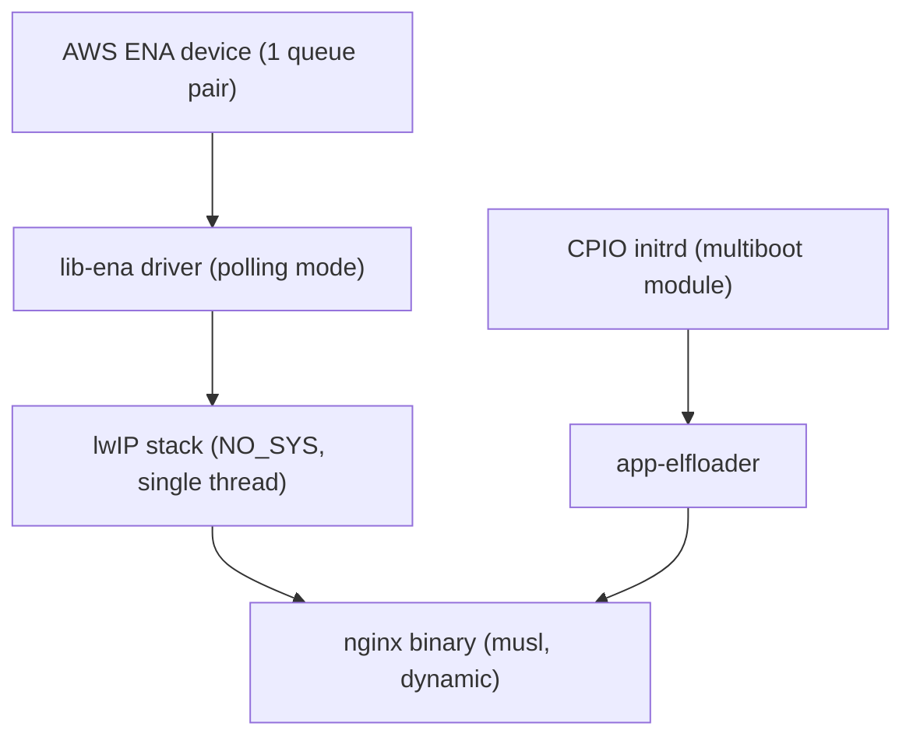

# Nginx on Unikraft with the native AWS ENA driver (`nginx`)

## 1. Overview

This sample runs the official Nginx web server inside a Unikraft unikernel
on AWS EC2. The network path uses the native ENA driver (`lib-ena`) and
the lwIP stack. The target is a 1 vCPU instance, such as `t3.micro`.

The sample uses the binary-compatibility path: `app-elfloader` loads the
Nginx ELF binary and its shared libraries from a CPIO initrd. You do not
build Nginx from source. The initrd comes from the official `nginx`
Alpine image, so the binary and the libraries match the ones upstream
ships.

Nginx runs in single-process mode: `master_process off`, `daemon off`,
and `worker_processes 1`. The unikernel has no process supervisor, so
Nginx must not fork.

## 2. Architecture



| Component | Role |
| :--- | :--- |
| `app-elfloader` | Loads `/usr/sbin/nginx` and side-loads the musl dynamic loader |
| `lib-lwip` | TCP/IP stack in single-threaded (`NO_SYS`) mode, DHCP client |
| `lib-ena` | Native ENA driver, one hardware queue pair |
| `initrd.cpio` | Root filesystem: nginx binary, shared libraries, config, web content |

GRUB loads the kernel and the initrd. The unikernel unpacks the initrd
into ramfs and mounts it at `/`
(`CONFIG_LIBVFSCORE_AUTOMOUNT_CI_INITRD`).

The ENA driver runs in software polling mode
(`CONFIG_LIBENA_MSIX=n`). Each socket call drives the netdev poll
(`CONFIG_LIBPOSIX_SOCKET_POLLED`), which is how an unmodified
application feeds the stack. The MSI-X path needs the local unikraft
patch that the `httpreply` samples carry, so this sample does not use it.

## 3. Directory layout

| Path | Purpose |
| :--- | :--- |
| `Kraftfile` | KraftKit spec: `app-elfloader`, `lib-lwip`, `lib-ena` from the repository root |
| `defconfig` | Kernel configuration for x86_64 KVM, initrd mount, and one ENA queue pair |
| `Dockerfile` | Builds the rootfs from `nginx:1.27-alpine` (musl-linked) |
| `conf/nginx.conf` | Nginx configuration for single-process operation |
| `conf/mime.types` | MIME type table |
| `html/index.html` | Test page served at `/` |
| `scripts/build_rootfs.sh` | Exports the Dockerfile rootfs to `initrd.cpio` |
| `scripts/elf_drop_empty_segments.py` | Drops empty PT_LOAD segments that GRUB rejects |
| `scripts/build_disk.sh` | Builds a GRUB-bootable raw disk image with kernel and initrd |
| `scripts/deploy_aws.py` | Uploads an EBS snapshot, registers an AMI, launches the instance |
| `scripts/qemu_local.sh` | Runs the image in QEMU with user-mode networking |
| `scripts/smoke_test.sh` | Checks HTTP status and response body against the running instance |

## 4. Prerequisites

- KraftKit 0.12 or newer, with the Unikraft toolchain.
- Docker or Podman, to build the rootfs.
- GRUB host tools (`grub-mkimage`), `parted`, and `mkfs.ext4`, to build the disk image.
- AWS CLI with credentials, and a VPC subnet to launch into.
- `app-elfloader` is not in the KraftKit package index. The build uses a
  local clone at `RELEASE-0.21.0`:

  ```bash
  git clone --branch RELEASE-0.21.0 --depth 1 \
    https://github.com/unikraft/app-elfloader .libs/app-elfloader
  ```

## 5. Build

### 5.1 Build the rootfs

```bash
./scripts/build_rootfs.sh
```

The script builds the `rootfs` stage of the Dockerfile, exports the
image, adds the runtime directories Nginx writes to, and writes
`initrd.cpio` in this directory.

### 5.2 Build the unikernel

```bash
kraft build --target aws-t3-x86_64 --no-prompt
```

Output: `.unikraft/build/aws-t3-x86_64_qemu-x86_64`, a Multiboot ELF
kernel.

## 6. Build the disk image

```bash
./scripts/build_disk.sh
```

The script writes `build/disk.raw`: an MBR disk with one ext4 partition
that holds GRUB, the kernel, and `initrd.cpio`. GRUB passes the initrd
to the kernel as a Multiboot module.

The script also rewrites the kernel image before it goes on the disk.
The host linker can leave an empty `PT_LOAD` at the address of the data
segment, and GRUB rejects an image with two load segments at one
address (`error: overlap detected`). See
`scripts/elf_drop_empty_segments.py`.

To set a static IPv4 for the ENA interface instead of DHCP:

```bash
NETDEV_IP=172.31.16.153/20 NETDEV_GW=172.31.16.1 ./scripts/build_disk.sh
```

The script adds ` --` after the `netdev.ip` argument. ukboot reads
library parameters only before ` --`. Everything after it goes to the
application. Without the separator, nginx receives `netdev.ip=...` as
an option and exits with `nginx: invalid option`. The script also puts
the instance's private IP inside the subnet's CIDR range. Check the
range with `aws ec2 describe-subnets` before you set `PRIVATE_IP`.

## 7. Deploy to Amazon EC2

```bash
SUBNET_ID=subnet-xxxxxx \
python3 scripts/deploy_aws.py
```

The script builds the rootfs and the kernel, uploads the disk to an EBS
snapshot, registers an AMI with `--ena-support`, opens TCP port 80 in a
security group, and launches a `t3.micro` instance. It then reads the
serial console and reports whether the driver, the network stack, and
nginx came up.

To use a static address instead of DHCP, also set `PRIVATE_IP`,
`GATEWAY_IP`, and `NETMASK`. To reuse an existing security group, set
`SG_ID`. To use another 1 vCPU type, set `INSTANCE_TYPE=c6i.large`.

## 8. Smoke test

```bash
./scripts/smoke_test.sh <instance-ip>
```

The script waits for the instance to answer HTTP, then checks:

1. `GET /` returns HTTP 200 and the test page.
2. A second `GET /` succeeds on a new connection.
3. `GET /missing-page` returns HTTP 404.

The script exits 0 when all checks pass.

## 9. Run locally with QEMU

QEMU has no ENA device, so this run uses the virtio-net driver that the
image also carries. It checks the rootfs, the ELF loader, and nginx. It
does not check the ENA driver.

```bash
./scripts/qemu_local.sh 120 18080      # 120 s run, host port 18080
./scripts/smoke_test.sh 127.0.0.1:18080
```

The guest console log is `build/qemu_local.log`.

## 10. Known limits

- One vCPU and one ENA queue pair. Multi-core nginx needs a different
  process and queue layout.
- The ENA driver runs in software polling mode. Interrupts need the
  local unikraft patch described in section 2.
- `sendfile` is off. The lwIP socket layer has no sendfile path, so
  nginx copies file data through user space.
- HTTP only. TLS is present in the binary, but this sample serves plain
  HTTP on port 80.
- The initrd is about 8 MB and lives in guest RAM.
