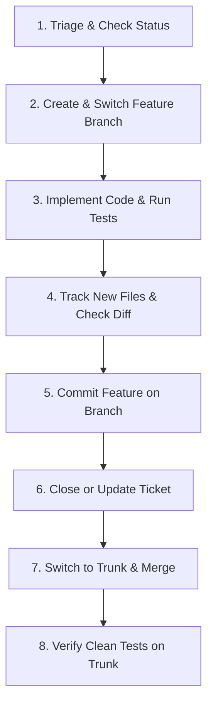

# Fossil SCM Instructions for AI Agents

This skill gives instructions for AI coding agents on how to use **Fossil SCM** effectively. It helps agents avoid common command errors and adapt Git habits to Fossil.

---

## 1. Core Architectural Differences (Git vs. Fossil)

| Feature | Git | Fossil SCM |
| :--- | :--- | :--- |
| **Repository File** | Scattered in `.git/` directory in root. | Single SQLite database file (`.fossil`), stored anywhere. |
| **Checkout State** | Stored in `.git/` directory. | SQLite database file `.fslckout` (or `_FOSSIL_`) in project root. |
| **Staging Area (Index)** | Required (`git add` before `git commit`). | **None**. `fossil commit` commits all modified tracked files. |
| **Default Branch Name** | `main` or `master`. | `trunk`. |
| **Branch Switching** | `git checkout <branch>` or `git switch`. | `fossil update <branch>` (*`fossil update` merges changes*). |
| **Syncing with Remote** | Explicit (`git push`, `git pull`). | **Autosync** by default (commits sync automatically). |
| **History Rewriting** | Supported (`git rebase`, `git reset`). | **Immutable by design**. Audit-log concept; history cannot change. |
| **Tracking New Files** | `git add <file>` | `fossil add <file>` (registers file; no staging phase needed). |
| **Removing Tracked Files** | `git rm <file>` | `fossil rm <file>` or `fossil forget <file>`. |

---

## 2. Command Mapping Reference (Git -> Fossil Cheat Sheet)

Use this table to translate Git commands to Fossil commands:

| Task | Git Command | Fossil Command | Important Notes |
| :--- | :--- | :--- | :--- |
| **Check Status** | `git status` | `fossil status` or `fossil changes` | `fossil status` shows branch and changes; `fossil changes` lists modified files. |
| **List Untracked** | `git status` (untracked section) | `fossil extras` | Shows untracked files not in the ignore list. |
| **Track New File** | `git add <file>` | `fossil add <file>` | Registers new file for tracking. Do not run on modified files. |
| **Auto-Sync Tracked Files**| N/A | `fossil addremove` | Automatically tracks new files and removes deleted files. |
| **Untrack File** | `git rm --cached <file>` | `fossil forget <file>` | Removes file from tracking without deleting local file. |
| **Delete File** | `git rm <file>` | `fossil rm <file>` | Deletes local file and marks it removed in SCM. |
| **Diff Workspace** | `git diff` | `fossil diff` | Shows uncommitted workspace changes. |
| **Diff Two Revisions** | `git diff <rev1> <rev2>` | `fossil diff --from <rev1> --to <rev2>` | **Caution**: Positional arguments mean filenames in Fossil. Use `--from` and `--to`. |
| **Show Commit Diff** | `git show <rev>` | `fossil diff --checkin <rev>` | Shows the diff introduced by a specific check-in. |
| **Inspect Commit Details** | `git show --stat <rev>` | `fossil info <rev>` | Shows metadata, parent, tags, and list of changed files. |
| **List Files in Revision** | `git ls-tree -r <rev>` | `fossil ls -r <rev>` | `fossil ls-tree` does NOT exist. Use `fossil ls -r <rev>`. |
| **Commit Changes** | `git commit -m "msg"` | `fossil commit -m "msg"` | Commits ALL modified tracked files. |
| **View History Timeline** | `git log` | `fossil timeline -n 10` | Displays check-in history timeline. |
| **File History** | `git log -p <file>` | `fossil finfo -l <file>` | Shows check-in history for a specific file. |
| **View File at Revision**| `git show <rev>:<file>` | `fossil cat <file> -r <rev>` | Outputs contents of file at specified revision. |
| **Revert File Changes** | `git restore <file>` | `fossil revert <file>` | Reverts uncommitted changes in file to last check-in. |
| **Undo SCM Operation** | `git reset` | `fossil undo` | Undoes last commit, update, merge, or revert. |
| **Create Branch** | `git checkout -b <branch>` | `fossil branch new <branch> trunk`<br>`fossil update <branch>` | Creates branch and switches checkout to it. |
| **Switch Branch** | `git switch <branch>` | `fossil update <branch>` | Updates working tree to branch. |
| **List Branches** | `git branch` | `fossil branch list` | Lists open branches. |
| **Current Branch** | `git branch --show-current` | `fossil branch current` | Prints the active branch name. |
| **Merge Branch** | `git merge <branch>` | `fossil merge <branch>`<br>`fossil commit -m "msg"` | Merges `<branch>` into current checkout. Then commit. |
| **Ignore Glob** | `.gitignore` | `.fossil-settings/ignore-glob` | Or set via `fossil setting ignore-glob "pattern"`. |

---

## 3. Critical Git Traps and Fossil Gotchas

Avoid these common mistakes made by AI agents:

### Trap 1: Positional arguments in `fossil diff`
- **Wrong**: `fossil diff 62397e791b bf4aa942dc`
  - *Result*: Fossil treats `62397e791b` and `bf4aa942dc` as local file paths and fails with `not found`.
- **Correct**:
  ```bash
  fossil diff --from 62397e791b --to bf4aa942dc
  ```

### Trap 2: `git ls-tree` does not exist in Fossil
- **Wrong**: `fossil ls-tree bf4aa942dc`
  - *Result*: `fossil: unknown command: ls-tree`.
- **Correct**:
  ```bash
  fossil ls -r bf4aa942dc
  ```

### Trap 3: `fossil changes` does not compare revisions
- **Wrong**: `fossil changes 62397e791b bf4aa942dc`
  - *Result*: `fossil changes` only inspects uncommitted local files against the current checkout baseline. It ignores extra arguments.
- **Correct**:
  To see files changed in a commit:
  ```bash
  fossil info <commit-hash>
  ```
  To see line differences between two revisions:
  ```bash
  fossil diff --from <rev1> --to <rev2>
  ```

### Trap 4: Do not run `fossil add` on modified files
- In Git, you must `git add` modified files to stage them.
- In Fossil, `fossil add` is ONLY for new untracked files.
- `fossil commit` automatically includes all modified tracked files.

---

## 4. Standard End-to-End Task Lifecycle Recipe

Follow this exact sequence when implementing features or fixing bugs:



### Step 1: Triage Environment
Check active branch, checkout status, and recent commits:
```bash
fossil status
fossil branch current
fossil timeline -n 5
```

### Step 2: Create Feature Branch
Create the new branch from `trunk` and switch to it:
```bash
fossil branch new feature/phaseX-name trunk
fossil update feature/phaseX-name
```

### Step 3: Implement and Test
Write code, add test cases, and execute the test harness:
```bash
make clean && make test
```

### Step 4: Track New Files
Register any newly created files for tracking:
```bash
fossil add <path/to/new_file1> <path/to/new_file2>
# Or automatically detect new and deleted files:
fossil addremove
# Check uncommitted modifications:
fossil status
fossil diff
```

### Step 5: Commit on Feature Branch
Commit with a descriptive message and reference the ticket UUID:
```bash
fossil commit -m "feat(subsystem): short summary

Detailed description of changes.
[Ticket <10-char-UUID>]"
```

### Step 6: Close the Ticket
Mark the ticket resolved:
```bash
fossil ticket change <10-char-UUID> \
  status "Closed" \
  resolution "Fixed" \
  +comment "Resolved on branch feature/phaseX-name in check-in [<commit-hash>]."
```

### Step 7: Switch to Trunk and Merge
Switch checkout back to `trunk`, merge the feature branch, and commit the merge:
```bash
fossil update trunk
fossil merge feature/phaseX-name
fossil commit -m "Merge feature/phaseX-name into trunk [Ticket <10-char-UUID>]"
```

### Step 8: Verify on Trunk
Run the test suite on `trunk` and make sure the working tree is clean:
```bash
make clean && make test
fossil status
fossil extras
```

---

## 5. Critical Safety Rules for AI Agents

1. **NEVER Delete Checkout State Files**:
   - Never delete `.fslckout` or `_FOSSIL_` in the workspace root.
2. **History is Immutable**:
   - Do not attempt `git rebase` or `git reset --hard`.
   - To correct a commit message after committing:
     ```bash
     fossil amend <commit-hash> -m "Corrected message"
     ```
3. **Use `fossil undo` for Safety**:
   - If `update`, `merge`, or `commit` caused an error, run `fossil undo` immediately.
4. **Ignore Patterns**:
   - Keep `.fossil-settings/ignore-glob` updated so agent session files and build artifacts do not clutter `fossil extras`.
